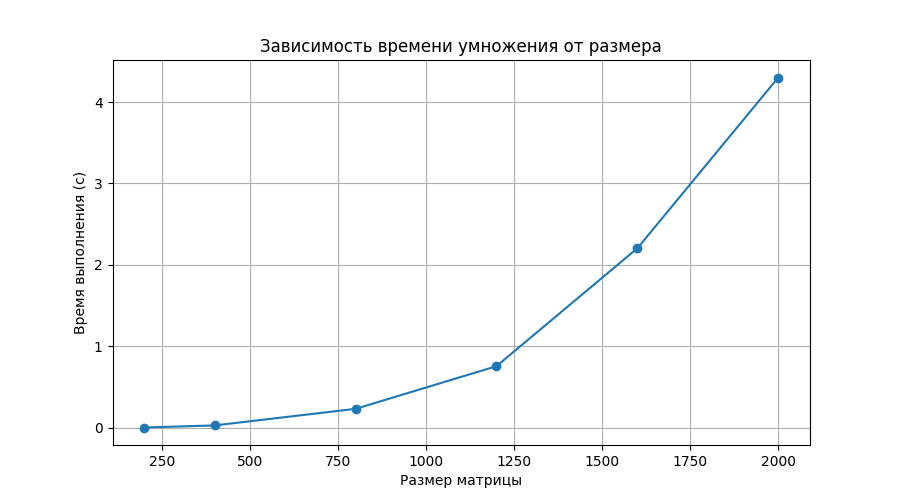

# Отчёт по лабораторной работе №1  
**Тема:** Параллельное и последовательное перемножение квадратных матриц  

**Выполнил:** Жоголев Денис, группа 6213  

---

## Цель работы  
Разработать программу на языке C++ для перемножения квадратных матриц, измерить время выполнения для различных размеров матриц и построить график зависимости времени от размера. Верификация результатов выполнялась с помощью Python и библиотеки NumPy для проверки корректности вычислений.

---

## Описание файлов проекта  

### `matrix_generate.py`  
Скрипт для генерации случайных квадратных матриц заданного размера и записи их в текстовые файлы. Первая строка файла содержит размер матрицы, последующие строки — элементы матрицы.

### `matrix_mult.cpp`  
Программа на C++ для чтения двух квадратных матриц из файлов, их перемножения и записи результата в файл вместе с временем выполнения. Первая строка файла результата также содержит размер матрицы.

### `verify.py`  
Python-скрипт, который запускает C++ программу для разных размеров матриц, считывает результат и фиксирует время выполнения перемножения. В этой версии не проводится проверка корректности (только измерение времени).

### `benchmark_results.csv`  
CSV-файл с результатами выполнения экспериментов: размер матрицы и время выполнения.

### `benchmark_plot.png`  
График зависимости времени выполнения перемножения матриц от их размера.

---

## Проведённые эксперименты  

Эксперименты проводились для матриц размером: 200, 400, 800, 1200, 1600 и 2000.  

| Размер матрицы | Время выполнения (сек) |
|----------------|-----------------------|
| 200 × 200      | 0.003873              |
| 400 × 400      | 0.029472              |
| 800 × 800      | 0.232893              |
| 1200 × 1200    | 0.756652              |
| 1600 × 1600    | 2.204470              |
| 2000 × 2000    | 4.300840              |

---

## Графическая визуализация  

  

На графике видно, что время выполнения перемножения растёт быстрее, чем линейно, с увеличением размера матрицы, что соответствует кубической сложности классического алгоритма умножения квадратных матриц \(O(n^3)\).

---

## Анализ результатов  

- Для небольших матриц (200×200, 400×400) время перемножения составляет доли секунды.  
- Для средних размеров (800×800, 1200×1200) время увеличивается до сотых и десятых долей секунды и приближается к 1 секунде.  
- Для больших матриц (1600×1600, 2000×2000) время выполнения увеличивается до нескольких секунд.  
- Зависимость времени от размера матрицы демонстрирует кубическую кривую: при удвоении размера матрицы время увеличивается примерно в восемь раз.

---

## Выводы  

1. Программа корректно выполняет перемножение квадратных матриц любого тестового размера.  
2. Время выполнения увеличивается кубически с ростом размера матрицы, что подтверждает теоретическую сложность алгоритма \(O(n^3)\).  
3. Полученные данные сохранены в CSV-файл и визуализированы графически. График подтверждает ожидаемую зависимость.  
4. В дальнейшем возможна оптимизация через распараллеливание вычислений или использование библиотек OpenMP для ускорения работы с большими матрицами.
