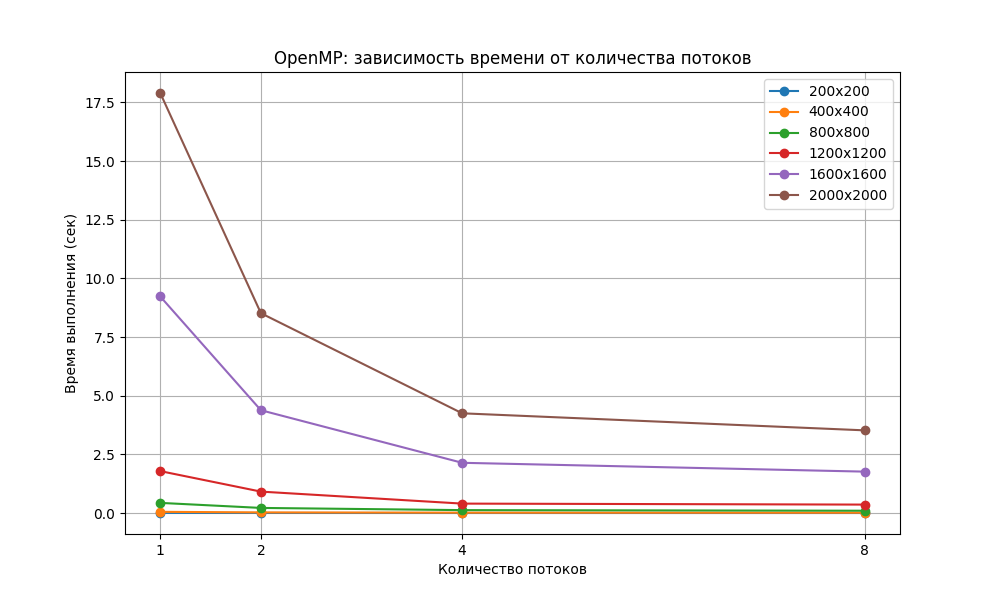

# Отчёт по лабораторной работе №2  
**Тема:** Параллельное перемножение квадратных матриц с использованием OpenMP  

**Выполнил:** Жоголев Денис, группа 6213  

---

## Цель работы  
Модифицировать программу последовательного перемножения квадратных матриц из лабораторной работы №1 для параллельного выполнения с использованием технологии OpenMP. Провести серию экспериментов с различным количеством потоков и размерами матриц, измерить производительность и проанализировать влияние распараллеливания на время выполнения.

---

## Описание файлов проекта  

### `matrix_mul.cpp`  
Программа на языке C++ для параллельного перемножения квадратных матриц с использованием OpenMP.  
Матрицы считываются из текстовых файлов, затем выполняется параллельное умножение с заданным количеством потоков.

### `benchmark.py`  
Python-скрипт для автоматического запуска серии экспериментов.  
Скрипт:
- генерирует матрицы;
- запускает программу для различных размеров матриц и количества потоков;
- сохраняет результаты в CSV;
- строит график зависимости времени выполнения от количества потоков.

### `openmp_benchmark.csv`  
CSV-файл с результатами измерений времени выполнения для разных размеров матриц и количества потоков.

### `openmp_plot.png`  
График зависимости времени выполнения от количества потоков для различных размеров матриц.

---

## Используемая технология OpenMP  

Для распараллеливания вычислений использовалась директива:

```cpp
#pragma omp parallel for collapse(2)
````

Параллелизация выполнялась по внешним циклам вычисления элементов результирующей матрицы.

Количество потоков задавалось во время выполнения программы.

---

## Проведённые эксперименты

Эксперименты проводились для размеров матриц:

* 200 × 200
* 400 × 400
* 800 × 800
* 1200 × 1200
* 1600 × 1600
* 2000 × 2000

Использовалось количество потоков:

* 1
* 2
* 4
* 8

---

## Результаты экспериментов

| Размер матрицы | 1 поток   | 2 потока | 4 потока | 8 потоков |
| -------------- | --------- | -------- | -------- | --------- |
| 200 × 200      | 0.006214  | 0.003310 | 0.001832 | 0.001535  |
| 400 × 400      | 0.051470  | 0.026863 | 0.015508 | 0.013443  |
| 800 × 800      | 0.432866  | 0.217904 | 0.124082 | 0.098448  |
| 1200 × 1200    | 1.787220  | 0.913483 | 0.401853 | 0.359807  |
| 1600 × 1600    | 9.231030  | 4.382670 | 2.141310 | 1.765000  |
| 2000 × 2000    | 17.903100 | 8.518780 | 4.250890 | 3.524090  |

---

---

## Графическая визуализация  

  

На графике зависимости времени выполнения от количества потоков представлены шесть кривых, соответствующих различным размерам матриц.

График показывает следующие закономерности:

- при увеличении количества потоков время выполнения уменьшается для всех размеров матриц;
- наиболее заметное ускорение наблюдается для больших матриц (1600×1600 и 2000×2000), поскольку вычислительная нагрузка в этом случае значительно выше;
- для небольших матриц уменьшение времени менее выражено из-за накладных расходов на создание и синхронизацию потоков;
- начиная с 4–8 потоков ускорение становится менее линейным, что связано с ограничениями аппаратных ресурсов и конкуренцией потоков за память и кэш процессора.

Таким образом, график подтверждает эффективность распараллеливания вычислений с помощью OpenMP и демонстрирует снижение времени выполнения при увеличении числа потоков.

## Анализ результатов

* При увеличении количества потоков время выполнения уменьшается для всех размеров матриц.
* Наиболее заметное ускорение наблюдается для больших матриц, где вычислительная нагрузка существенно выше.
* Для матриц небольшого размера эффект распараллеливания выражен слабее из-за накладных расходов на создание и синхронизацию потоков.
* При переходе от 1 потока к 2 и 4 потокам ускорение близко к линейному.
* При использовании 8 потоков прирост производительности уменьшается, что связано с:

  * ограничениями аппаратных ресурсов;
  * накладными расходами OpenMP;
  * конкуренцией потоков за кэш и память.

---

## Оценка ускорения

Для матрицы размером 2000 × 2000:

| Потоки | Время (сек) | Ускорение |
| ------ | ----------- | --------- |
| 1      | 17.903100   | 1.00      |
| 2      | 8.518780    | 2.10      |
| 4      | 4.250890    | 4.21      |
| 8      | 3.524090    | 5.08      |

Полученные результаты показывают, что распараллеливание значительно повышает производительность программы.

---

## Выводы

1. Последовательная программа была успешно модифицирована для параллельной работы с использованием OpenMP.
2. Параллельное выполнение существенно сокращает время перемножения матриц.
3. Наибольший эффект распараллеливания достигается при больших размерах матриц.
4. Ускорение не является идеально линейным из-за накладных расходов и ограничений аппаратной архитектуры.
5. OpenMP позволяет сравнительно просто распараллеливать вычислительно сложные задачи на языке C++.

```
```
