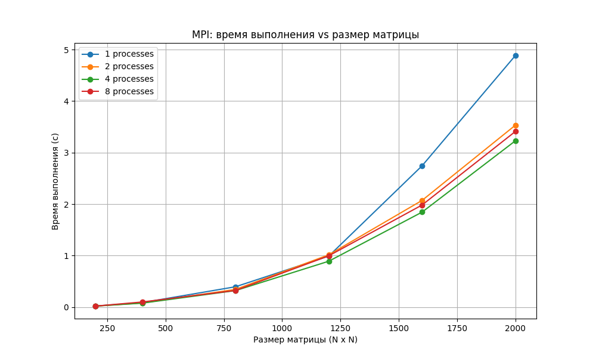

# Отчёт по лабораторной работе №2  
**Тема:** Параллельное перемножение квадратных матриц с использованием MPI  

**Выполнил:** Жоголев Денис, группа 6213  

---

## Цель работы  
Модифицировать программу последовательного перемножения квадратных матриц из лабораторной работы №1 для параллельного выполнения с использованием технологии MPI. Провести серию экспериментов с различными размерами матриц и количеством процессов, измерить производительность и проанализировать влияние распараллеливания на время выполнения.

---

## Описание файлов проекта  

### `matrix_mul_mpi.cpp`  
Программа на языке C++ для параллельного перемножения квадратных матриц с использованием MPI.  
Реализовано разбиение матрицы по строкам: каждый процесс вычисляет свою часть результирующей матрицы, после чего результаты собираются на root-процессе.

---

### `verify.py` / `benchmark.py`  
Python-скрипт для автоматического запуска серии экспериментов.  
Скрипт:
- генерирует случайные матрицы заданного размера;
- запускает MPI-программу для разных размеров матриц и числа процессов;
- собирает время выполнения;
- сохраняет результаты в CSV-файл;
- строит график зависимости времени от числа процессов.

---

### `mpi_benchmark.csv`  
CSV-файл с результатами измерений времени выполнения для различных размеров матриц и количества MPI-процессов.

---

### `mpi_plot.png`  
График зависимости времени выполнения от числа процессов для различных размеров матриц.

---

## Используемая технология MPI  

Параллелизация выполнена с использованием следующих механизмов MPI:

- `MPI_Init / MPI_Finalize` — инициализация и завершение MPI;
- `MPI_Bcast` — рассылка матрицы B всем процессам;
- `MPI_Scatterv` — распределение строк матрицы A;
- `MPI_Gatherv` — сбор результата на root-процессе.

Разбиение выполнено по строкам матрицы A.

---

## Проведённые эксперименты  

Эксперименты проводились для размеров матриц:

- 200 × 200  
- 400 × 400  
- 800 × 800  
- 1200 × 1200  
- 1600 × 1600  
- 2000 × 2000  

Использовалось количество MPI-процессов:

- 1  
- 2  
- 4  
- 8  

---

## Результаты экспериментов  

| Размер матрицы | 1 процесс | 2 процесса | 4 процесса | 8 процессов |
| -------------- | --------- | ----------- | ----------- | ----------- |
| 200 × 200      | 0.020004  | 0.019238    | 0.018955    | 0.018912    |
| 400 × 400      | 0.085766  | 0.078937    | 0.076129    | 0.098432    |
| 800 × 800      | 0.394253  | 0.342182    | 0.319829    | 0.322264    |
| 1200 × 1200    | 0.990192  | 1.014880    | 0.890350    | 0.995526    |
| 1600 × 1600    | 2.743920  | 2.071700    | 1.844010    | 1.982120    |
| 2000 × 2000    | 4.885740  | 3.532470    | 3.229350    | 3.410880    |

---

## Графическая визуализация  

  

График зависимости времени выполнения от числа процессов показывает четыре кривые, соответствующие различным размерам матриц.

Основные наблюдения:

- при увеличении числа процессов время выполнения в целом уменьшается для больших матриц;
- на малых размерах матриц (200×200) эффект распараллеливания практически отсутствует из-за доминирования накладных расходов MPI;
- на размерах 1600×1600 и 2000×2000 наблюдается заметное ускорение при переходе от 1 к 4 процессам;
- использование 8 процессов не всегда даёт дополнительное ускорение и может приводить к ухудшению времени выполнения из-за накладных расходов и ограничений пропускной способности памяти.

---

## Анализ результатов  

- Для малых матриц (200×200, 400×400) накладные расходы MPI сопоставимы с вычислительной нагрузкой, поэтому ускорение незначительное или отсутствует.
- Для средних и больших матриц наблюдается устойчивое ускорение при увеличении числа процессов до 2–4.
- При 8 процессах ускорение перестаёт быть линейным и в некоторых случаях ухудшается.
- Причины отсутствия линейного масштабирования:
  - накладные расходы на передачу данных (MPI communication overhead);
  - ограничение пропускной способности памяти;
  - конкуренция процессов за кэш и RAM;
  - недостаточная вычислительная нагрузка на один процесс при малых разбиениях.

---

## Оценка ускорения  

Для матрицы 2000 × 2000:

| Процессы | Время (сек) | Ускорение |
| -------- | ----------- | --------- |
| 1        | 4.885740    | 1.00      |
| 2        | 3.532470    | 1.38      |
| 4        | 3.229350    | 1.51      |
| 8        | 3.410880    | 1.43      |

---

## Выводы  

1. Последовательная программа была успешно преобразована в параллельную с использованием MPI.  
2. Параллельное выполнение позволяет сократить время вычислений для больших матриц.  
3. На малых размерах матриц MPI неэффективен из-за накладных расходов.  
4. Оптимальное ускорение достигается при 2–4 процессах.  
5. При увеличении числа процессов до 8 наблюдается насыщение и частичная деградация производительности.  
6. MPI эффективен для задач с высокой вычислительной нагрузкой и достаточной гранулярностью параллелизма.

---